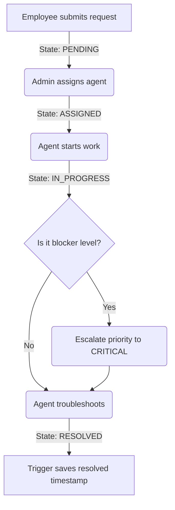

# Enterprise Service Request Management System (ESRMS) - System Walkthrough

This document provides a comprehensive overview of the **ESRMS** system, detailing its key user roles, core ticket lifecycle workflow, database integration features, and administration capabilities.

---

## 1. System Overview & Target Audience

The **Enterprise Service Request Management System (ESRMS)** is a modern IT Service Management (ITSM) web portal. It coordinates helpdesk operations, service request lifecycles, and corporate asset relationships, allowing IT staff and employees to resolve organizational IT issues efficiently.

---

## 2. Key User Roles & Responsibilities

The system divides functionality among three distinct user roles, each accessing customized views:

| Role | Default User | Primary Portals & Components | Key Responsibilities |
| :--- | :--- | :--- | :--- |
| **Employee** | Vikas Sagar (`vikas@company.com`) | [EmployeeDashboard.jsx](file:///c:/Users/Vikas/Desktop/Enterprise-Service-Request-Management-System/frontend/src/pages/employee/EmployeeDashboard.jsx) | Submit requests, link assets, track ticket statuses, and confirm closures. |
| **Agent / Team Lead** | Manjoth Singh (`manjoth@company.com`) / Shruti (`shruti@company.com`) | [AgentDashboard.jsx](file:///c:/Users/Vikas/Desktop/Enterprise-Service-Request-Management-System/frontend/src/pages/agent/AgentDashboard.jsx) | Claim/resolve tickets, log resolution details, transition statuses, and escalate blockers. |
| **Administrator** | Admin User (`admin@company.com`) | [AdminDashboard.jsx](file:///c:/Users/Vikas/Desktop/Enterprise-Service-Request-Management-System/frontend/src/pages/admin/AdminDashboard.jsx) | Manage directories (users, agents, assets), assign pending tickets, and monitor analytical dashboards. |

---

## 3. Core Ticket Lifecycle Workflow

The lifecycle of a service request follows a structured state machine:

1. **Ticket Creation (Employee)**:
   * Employees log in and access the request creation page.
   * They specify a title, description, category (e.g., Hardware, Software, Network), priority (LOW, MEDIUM, HIGH), and select the target hardware or software asset from their associated catalog.
   * Upon creation, the ticket is registered in the database with status `PENDING`.

2. **Ticket Assignment (Admin)**:
   * The Administrator reviews new `PENDING` service tickets in the central workspace.
   * The Admin assigns the ticket to an active Agent (tracking the agent's current workload in the process).
   * Once assigned, the ticket transition state updates to `ASSIGNED` (and audit logs are written automatically via triggers).

3. **Troubleshooting & Escalation (Agent)**:
   * The assigned Agent views the ticket in their workload inbox.
   * The agent marks the ticket as `IN_PROGRESS` to notify the employee that work is underway.
   * If the issue is critical or requires priority elevation, the agent can escalate the ticket directly to `CRITICAL`.

4. **Resolution (Agent)**:
   * Once the issue is resolved, the agent inputs "Resolution Details" (an explanation of the fix) and marks the ticket as `RESOLVED`.
   * This action fires database triggers to store the `resolved_at` timestamp.

---

## 4. Key Database & Trigger Features

The system relies on automatic database logic (implemented in MySQL) to guarantee historical tracking and SLA logging:

* **Automatic Resolution Timestamping**: 
  * The trigger `trg_set_resolved_time` intercept update queries and sets `resolved_at = CURRENT_TIMESTAMP` once status becomes `RESOLVED`.
* **State Change Audit History**:
  * The trigger `trg_request_status_history` records all state transitions into the `request_history` table for audit reporting.
* **Assignment Log Audit**:
  * The trigger `trg_assignment_audit` logs a text event into the global audit logs table whenever a request is assigned to an agent.

Refer to the database trigger configuration at [02_triggers.sql](file:///c:/Users/Vikas/Desktop/Enterprise-Service-Request-Management-System/database/02_triggers.sql).

---

## 5. Administrative Controls

The Administrator interface provides analytical oversight and governance options:

* **User Registry Manager**: CRUD operations over users, roles, and profiles inside [ManageUsers.jsx](file:///c:/Users/Vikas/Desktop/Enterprise-Service-Request-Management-System/frontend/src/pages/admin/ManageUsers.jsx).
* **Agent Workload Monitor**: Track active support agents, workloads, and department details in [ManageAgents.jsx](file:///c:/Users/Vikas/Desktop/Enterprise-Service-Request-Management-System/frontend/src/pages/admin/ManageAgents.jsx).
* **Corporate Asset Catalog**: Register company hardware, serial numbers, and software licenses in [ManageAssets.jsx](file:///c:/Users/Vikas/Desktop/Enterprise-Service-Request-Management-System/frontend/src/pages/admin/ManageAssets.jsx).
* **Analytics & Performance Scorecards**: The analytical dashboard [Reports.jsx](file:///c:/Users/Vikas/Desktop/Enterprise-Service-Request-Management-System/frontend/src/pages/admin/Reports.jsx) uses interactive **Recharts** charts to visualize:
  * SLA violation counts.
  * Ticket volume by category.
  * Agent resolution counts scorecard.
